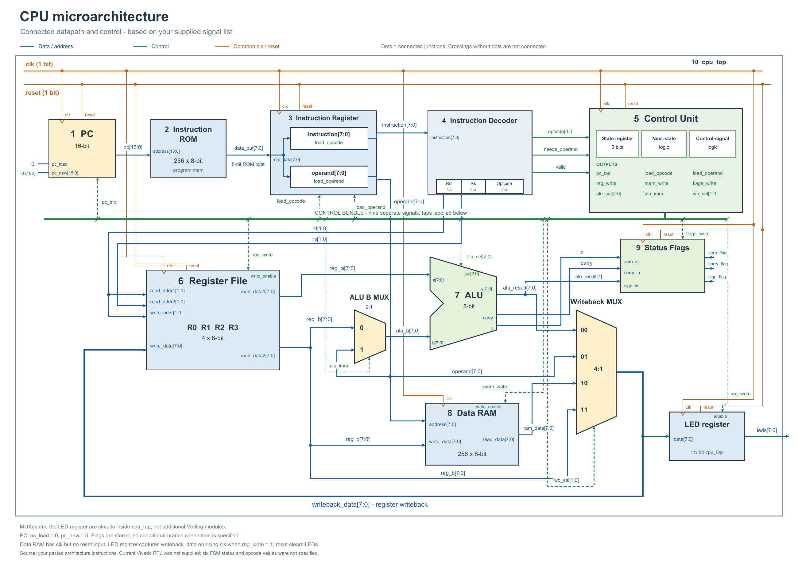
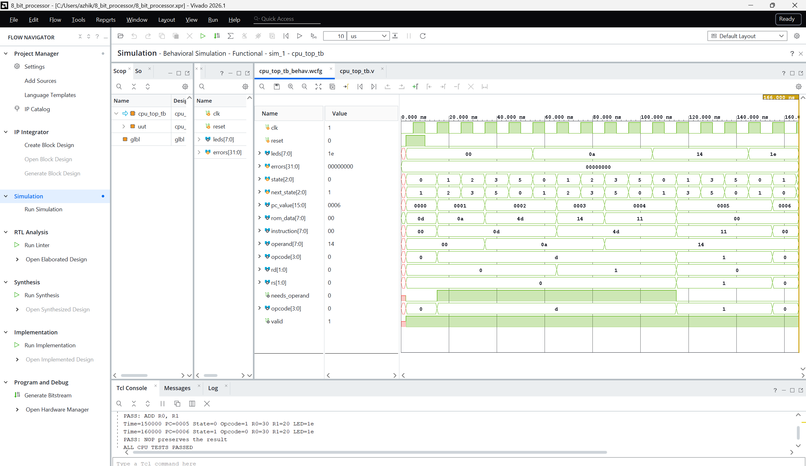

Custom 8-Bit Multi cycle Processor Using Verilog HDL

RTL Design | Harvard Architecture | 14-Instruction ISA | FSM-Based Control | AMD Vivado

Overview

This project implements a custom 8-bit multicycle processor using Verilog HDL. The processor follows Harvard architecture, with separate instruction and data memories, and executes instructions through a six-state finite state machine (FSM).

The CPU was developed as a modular RTL design to explore processor architecture, digital datapath design, instruction decoding, memory interfacing, control-signal generation and functional verification.

The current implementation supports 14 custom instructions, four general-purpose registers, arithmetic and logical operations, immediate operands, data-memory access and register writeback.

Current status: RTL design, behavioral simulation and reported synthesis completed. Deployment and validation on the Digilent Basys 3 FPGA board are planned.
program counter ->instruction rom->instruction register->instruction decoder->register file->alu/data ram->write back 

| Component | Specification |
|---|---|
| Architecture | Harvard |
| Data Width | 8 bits |
| Program Counter | 16 bits |
| Instruction ROM | 256 × 8 bits |
| Data RAM | 256 × 8 bits |
| Register File | 4 × 8-bit registers |
| Control Unit | 6-state FSM |

## Instruction Set Architecture (ISA)

| Opcode (Hex) | Instruction | Operation | Size |
|---|---|---|---|
| `0` | NOP | No operation | 1 byte |
| `1` | ADD | Rd = Rd + Rs | 1 byte |
| `2` | SUB | Rd = Rd - Rs | 1 byte |
| `3` | AND | Rd = Rd & Rs | 1 byte |
| `4` | OR | Rd = Rd \| Rs | 1 byte |
| `5` | MOV | Rd = Rs | 1 byte |
| `6` | NOT | Rd = ~Rd | 1 byte |
| `7` | LDA | Rd = RAM[immediate address] | 2 bytes |
| `8` | STA | RAM[immediate address] = Rs | 2 bytes |
| `9` | ADDI | Rd = Rd + immediate | 2 bytes |
| `A` | SUBI | Rd = Rd - immediate | 2 bytes |
| `B` | ANDI | Rd = Rd & immediate | 2 bytes |
| `C` | ORI | Rd = Rd \| immediate | 2 bytes |
| `D` | MOVI | Rd = immediate | 2 bytes |

## Processor Architecture

## Simulation Results

